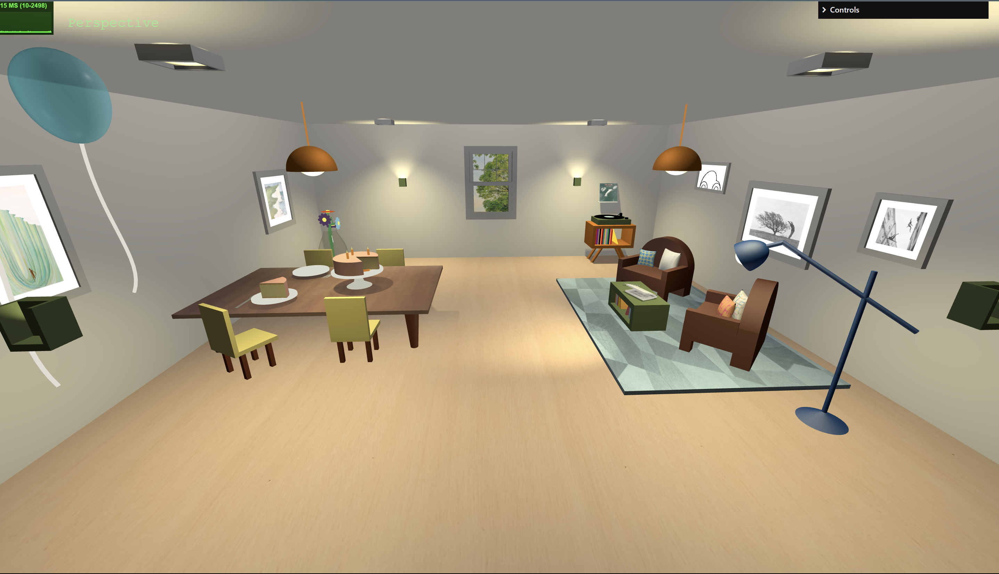

# SGI 2023/2024 - TP1

## Group: T05G04

| Name             | Number    | E-Mail             |
| ---------------- | --------- | ------------------ |
| Mafalda Costa    | 202006417 | up202006417@up.pt  |
| Mariana Carvalho | 202007620 | up202007620@up.pt  |

----
## Project information

- Main strong points
  - The cake and slice sizes are relative to each other.
  - Vinyl holder and furniture.
  - Good lighting.
  - The extras complement quite nicely the scene.

- Scene Description
  - When you walk through the door you see our living room.
  - In the living room there is a table with a birthday cake with candles, a slice cut out of the cake, two plates and two forks. There are four chairs around the table and some festive balloons. The lamp on top of the table is a spotlight targeting the cake. On the left corner on the back there is a big vase with four flowers. 
  - On the center of the back wall is a window with a view to the outside.
  - On the right side of the scene there is the sitting area with two armchairs and four pillows. There is a newspaper and spiral spring on top of a coffee table.
  - On the right back corner there is a vinyl playing on top of its holder. The cover of the vinyl that is currently playing is sitting on top of a small shelf.
  - The living room is decorated with paintings and photos and has several light sources illuminating the scene. 
  
- **Link to the scene**: http://127.0.0.1:5593/tp1/

Note that the door is not on the scene for better visibility.

----
## Issues/Problems

- We had some difficulties when trying to simulate certain types of materials, like glass.
- Sometimes we struggled with the lights' position when they were part of an object's group.
- We had problems when trying to create cameras targeting specific features.
- Whe had difficulties when trying to adapt the texture to some parts of the pillows because they are curved surfaces.
