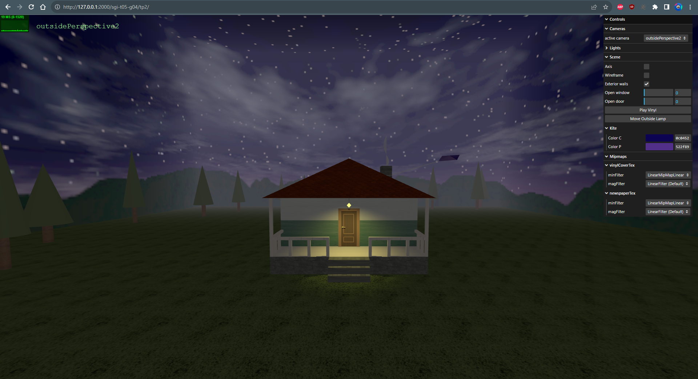
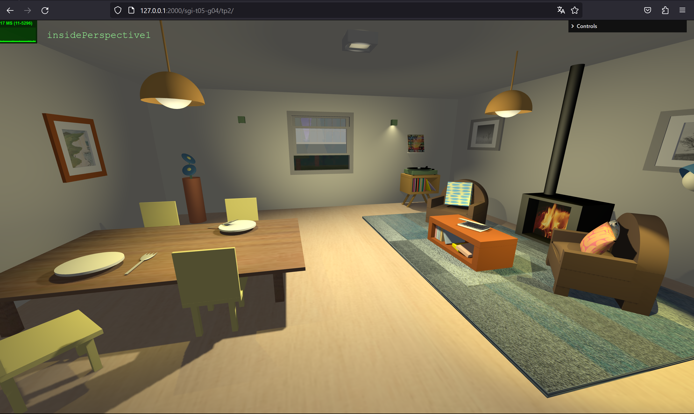

# SGI 2023/2024 - TP2

## Group: T05G04

| Name             | Number    | E-Mail             |
| ---------------- | --------- | ------------------ |
| Mafalda Costa    | 202006417 | up202006417@up.pt  |
| Mariana Carvalho | 202007620 | up202007620@up.pt  |

----
## Project information

- Main strong points
  - What can be controlled through the interface.
  - The lighting.
  - The video textures integrated in the scene - the fireplace and the vinyl song.
  - The use of polygons as lods.

- Scene Description
  - In a night setting, a house is surrounded by stars, trees, and fog. The house features a chimney with an adjustable-color kite attached. It also has a porch, a door, and an outdoor light swaying from a string, that can mimick the effect of wind.
  - The door can be interactively opened, revealing the living room when you pass through it.
  - On the left side of the living room, a table is set with two plates and two forks. Four chairs surround the table, and a lamp sits atop it. In the back left corner, there is a vase with two flowers. 
  - In the center of the back wall, there is a window with a view to the outside. It can be opened and closed as wanted.
  - On the right side, there is the sitting area with two armchairs and three pillows. There's a fireplace with the fire lit up. A newspaper sits on top of a coffee table. In the right back corner there is a vinyl on top of its holder. The cover of the vinyl is sitting on top of a small shelf. There is a button on the interface controls that when activated, the vinyl's rotation begins and music starts playing.
  - The living room is decorated with paintings and photos and has several light sources illuminating the scene. The lights can be enabled and disabled in the interface controls as well as their property "cast shadows".
  
- **Link to the scene**: http://127.0.0.1:5593/tp2/

- Features
  - **Lods**: vase, flowers, pillows, sofa seat, and trees.
  - **Mipmaps**: vinyl cover (sitting on top of the shelf), and newspaper.
  - **Buffer geometry**: third lod of the pillows, outside lamp, and kite.
  - **Bump textures**: grass, carpet, stone, and roof tiles.
  - **Video textures**: fireplace fire, and vinyl song.

----
## Issues/Problems
We had more difficulties at:
- Choosing textures and simulating certain types of materials.
- Applying correctly the inherited properties to a object.
- Applying the textures seamlessly to the roof and oustide walls of the house, due to them being made of different meshes.
