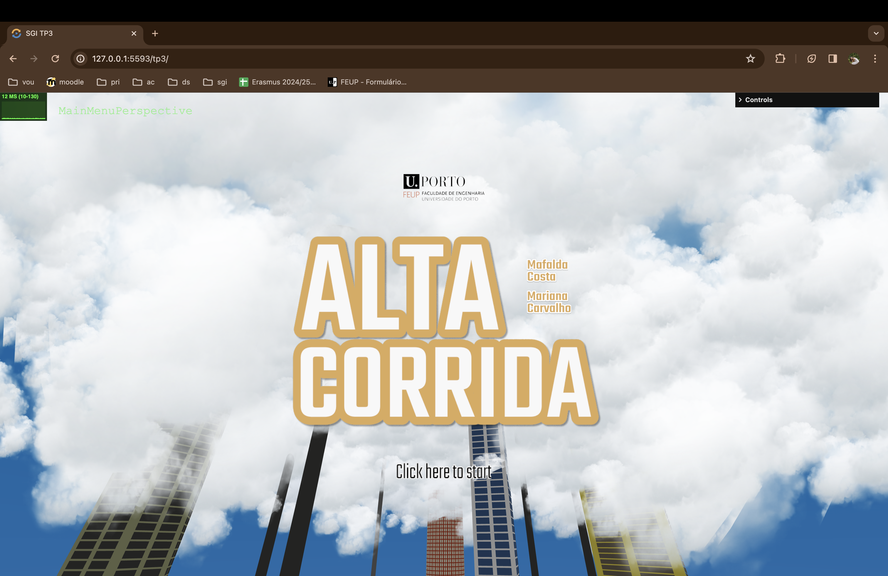
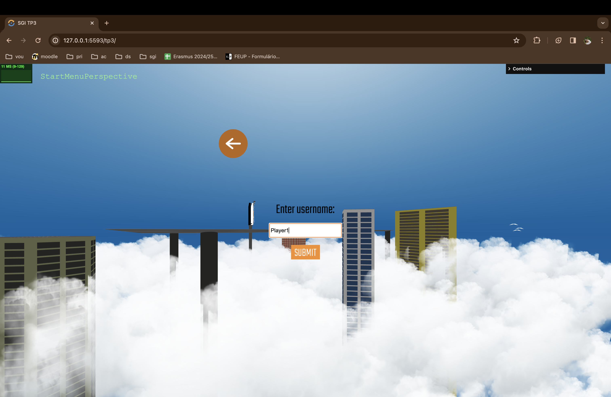
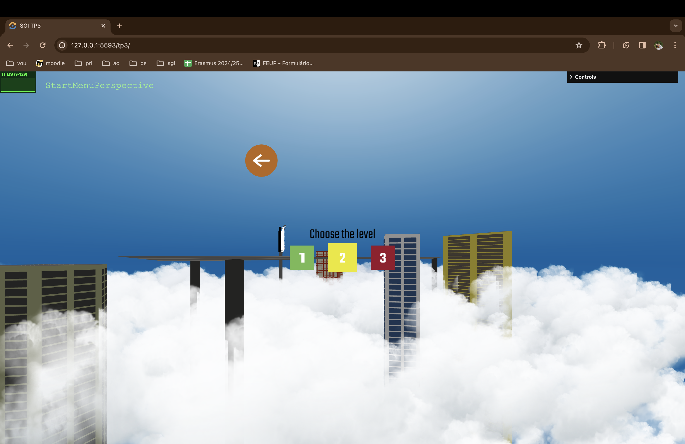
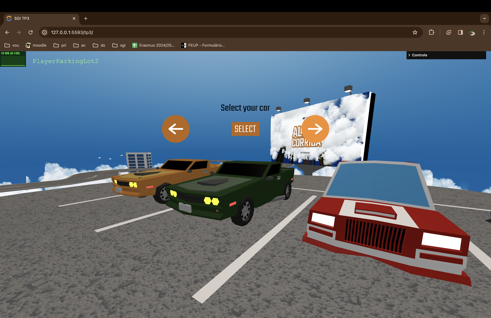
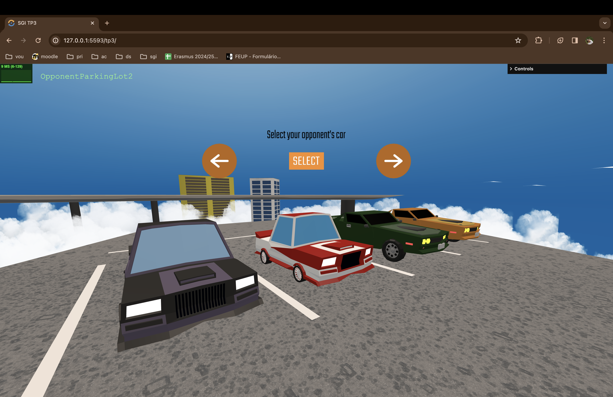
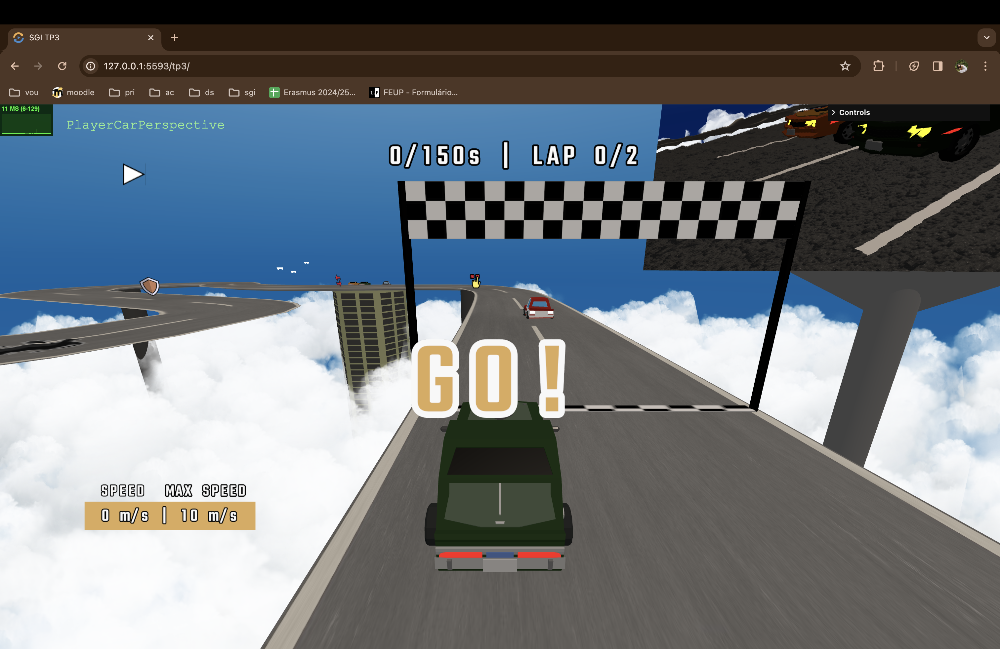
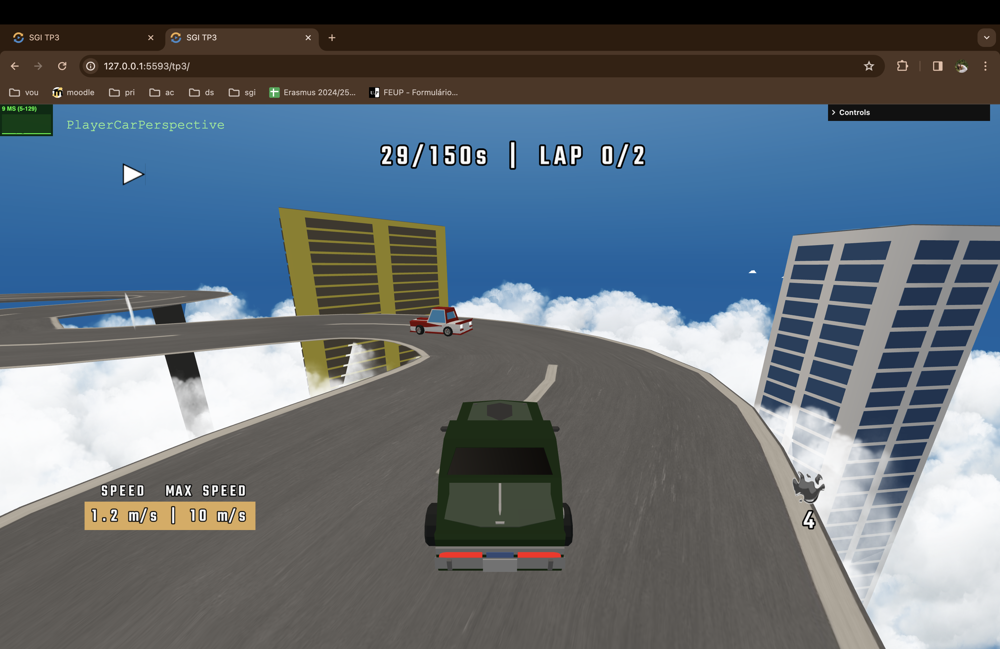
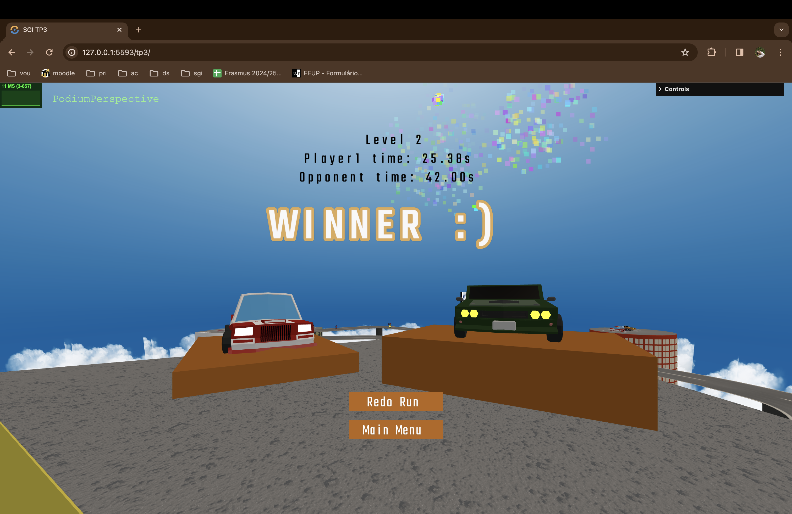

# SGI 2023/2024 - TP3

## Group: T05G04

| Name             | Number    | E-Mail             |
| ---------------- | --------- | ------------------ |
| Mafalda Costa    | 202006417 | up202006417@up.pt  |
| Mariana Carvalho | 202007620 | up202007620@up.pt  |

----
## Project information

- Main strong points
  - Shortcut power up
  - Creative scenario
  - Menu interaction
  - Spritesheets

- Scene description
    - Upon opening the game, the main menu reveals the game logo, author's name, and the FEUP logo. A button invites users to start the game interaction.
    
    
    - Clicking the start button redirects users to the enter username menu.
    
    - Users proceed to choose the desired level.
    
    - The next step involves selecting the car for the user to play with.
    
    - Similarly, users pick the opponent's car.
    
    - Upon completion, users are redirected to the track, and a countdown initiates the run. The moment "GO!" appears on the screen, the run starts, as demonstrated below:
    
    - Obstacles and power-ups are placed along the track. Collision with these elements modifies the run flow. For instance, colliding with the the "pick obstacle" power-up redirects users to choose an obstacle and select a location to place it on the track.
    - Pick Obstacle:
      
    - Place Obstacle:
      
    - During gameplay, real-time information such as elapsed time, laps completed, velocity, and applied modifiers with their remaining duration is displayed.
    
    - Upon finishing the run, users see the time taken, opponent's time, and the winner. The final menu provides options to return to the main menu or redo the run.
    

----
## Issues/Problems

- (items describing unimplemented features, bugs, problems, etc.)
